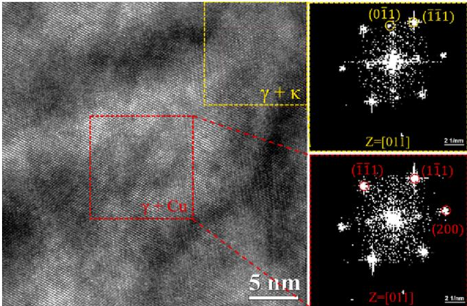
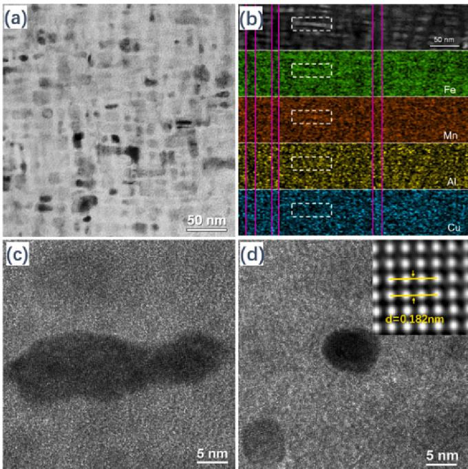

# Co-precipitation mechanism of Cu-rich phase and κ-carbide precipitates in Fe-28Mn-10Al-1C-3Cu austenitic low-density steel

Xiqiang Ren, Yanfei Qi , Yungang Li, Jingyi Zhou, Jiahao Gu

College of Metallurgy and Energy, North China University of Science and Technology, Tangshan 063210, PR China

# AR TI CLE I N F O

Keywords:   
Austenitic low-density steel   
Particles   
Nanosize   
Microstructure   
Co-precipitation mechanism

# A B S T R A C T

The excellent comprehensive properties of Fe-28Mn-10A1-1C-3Cu austenitic low-density steel are related to its main precipitates of Cu-rich phase and $\mathbf { \kappa } \kappa$ -carbide particles. The co-precipitation mechanism of Cu-rich phase and K-carbide particles in Fe-28Mn-10Al-1C-3Cu austenitic low-density steel are investigated. Adding Cu to Fe-28Mn-10Al-1C austenitic low-density steel can promote the precipitation of $\kappa$ carbide. The $\mathbf { \kappa } \kappa$ -carbide can also promote the precipitation of Cu-rich phase with FCC structure. The $\kappa$ -carbide preferentially precipitate compared to Curich phase. The $\kappa \cdot$ carbide and Cu-rich phase have a cube-on-cube orientation relationship with the austenitic matrix: $[ 1 1 0 ] _ { \gamma } / / [ 1 1 0 ] _ { \kappa } / / [ 1 1 0 ] _ { \mathrm { C u } }$ and $( 1 1 1 ) _ { \gamma } / / ( 1 1 1 ) _ { \kappa } / / ( 1 1 1 ) _ { \mathrm { C u } }$

# 1. Introduction

Fe-Mn-Al-C austenitic low-density steel is considered one of the important advanced high-strength steels in automotive structural reinforcements due to it's the demands of safety, light-weighting, and ecofriendliness. However, the yield strength of Fe-Mn-Al-C austenitic lowdensity steel is relatively low, only $3 6 0 \sim 5 4 0 ~ \mathrm { M P a }$ [1]. Therefore, it is necessary to further improved the yield strength to ensure that its structure undergoes micro-deformation or even no deformation during car collisions, thereby reducing the harm to drivers and passengers [2]. The $\kappa$ -carbide precipitated in Fe-Mn-Al-C austenitic matrix steel can increase the yield strength [3–5]. But relying solely on $\kappa$ -carbide to enhance its yield strength is not enough. Cu alloying can improve the yield strength of Fe-Mn-Al-C low-density steel [6], which is related to Cu-rich phase. The precipitation strengthening of nanoscale Cu-rich phase in steel can also improve its corrosion resistance, resist fatigue crack propagation, hydrogen embrittlement resistance, and Cu is inexpensive. The excellent comprehensive properties of Fe-Mn-Al-C-Cu lowdensity steel are related to its main precipitates of Cu-rich phase and K-carbide. Currently, although literature reports that the precipitation behavior of $\kappa$ -carbide or Cu-rich phase in austenitic low-density steel [7–9], the co-precipitation behavior and mechanism of Cu-rich phase and $\kappa$ -carbide are still unclear and have not been reported. Clarifying the co-precipitation behavior and mechanism is of great significance for improving the comprehensive properties of austenitic low-density steel. In this paper, the co-precipitation behavior and mechanism of Cu-rich phase and $\kappa$ -carbide in Fe-28Mn-10Al-1C-3Cu austenitic low-density steel are investigated.

# 2. Materials and methods

The Fe-28Mn-10Al-1C-(0,3)Cu austenitic low-density steel (0Cu steel or 3Cu steel) with nominal composition are processed by solution treatment (at $1 0 0 0 ^ { \circ } \mathrm { C }$ for $^ \textrm { \scriptsize 1 h }$ ) and aging treatment ( at $5 5 0 ^ { \circ } \mathsf { C }$ for $^ { 3 \mathrm { ~ h ~ } }$ ) sequentially. The microstructure is examined by high-resolution transmission electron microscope (HR-TEM, JEOL JEM-2100F) with an energy dispersive spectrometer (EDS) detector. The TEM samples with a diameter of $3 \mathrm { m m }$ are mechanically polished to about $1 0 0 \mu \mathrm { m }$ thickness, and then are twin-jet electro-polished in $1 0 ~ \%$ perchloric acid alcohol.

# 3. Results and discussion

The Cu-rich phase in ferrite generally precipitates with BCC structure first and finally transforms into steady-state FCC structure [10]. However, the Cu-rich phase in austenitic precipitates directly in the FCC structure [11]. According to selected area electron diffraction (SAED) analysis, the Cu-rich phase has BCC structure (Fig. 1, inset). In addition, no additional diffraction spots are observed except for Cu-rich phase and $\kappa$ -carbide, indicating that the $\kappa$ -carbide and Cu-rich phase are coherent with the austenitic matrix.

Fig. 2 shows the HR-TEM images of Cu-rich phase which has no obvious interface with austenitic matrix, indicating a coherent relationship between Cu-rich phase and austenitic matrix. The Cu-rich phase is mainly iregular oval and has a small amount of bars shapes, which the diameter of irregular oval Cu-rich phase is $\sim 1 0 \ \mathrm { n m }$ and the length of bars shapes Cu-rich phase is $\sim 3 0 ~ \mathrm { n m }$ . The IFFT photos show that there are almost no dislocations and stacking faults in the Cu-rich phase, and Cu-rich phase crystal plane spacing $( 0 0 ~ \overline { { 2 } } )$ is $0 . 1 8 2 \ \mathrm { n m }$ which is consistent with Cu in FCC structure [12]. The lattice parameter of FCC Cu-rich phase and $\kappa$ -carbide are $\mathbf { a } = 0 . 3 6 5 2 \ : \mathrm { n m }$ and $\mathbf { a } = 0 . 3 7 7 5$ nm, respectively. The lattice parameter of austenitic matrix under solution treatment is $\mathbf { a } = 0 . 3 6 8 9 \ \mathrm { n m }$ obtained by XRD. Due to the close lattice parameters of Cu-rich phase and $\kappa$ -carbide with the austenitic matrix. Thus, it is difficult to distinguish the diffraction separation.

  
Fig. 1. SAED patterns of Cu-rich phase and κ-carbide in-aged 3Cu steel.

  
Fig. 2. TEM images of aged 3Cu steel (a), EDS mapping (b), HRTEM image of Cu-rich phase with irregular oval (c) and HRTEM image of Cu-rich phase with bars shapes(d).

According to the lattice misfit formula (1), it can be calculated that the lattice misfit between $\kappa$ -carbide and Cu-rich phase is $3 . 4 ~ \%$ ,the lattice misfit between $\kappa$ -carbide and austenitic matrix is $2 . 3 ~ \%$ , and the lattice misfit between Cu-rich phase and austenitic matrix is $1 . 0 \%$ . Due to the lattice misfit between the three phases being less than $5 \%$ ,the three phases are in a coherent relationship. The lattice misfit between

Cu-rich phase and austenitic matrix is lower than that between Cu-rich phase and $\kappa$ -carbide. Therefore, Cu-rich phase has a lower nucleation energy barrier in austenitic matrix. Cu-rich phase precipitated in austenitic matrix instead of $\kappa$ -carbide, and the precipitation of $\kappa$ -carbide can promote the precipitation of Cu-rich phase.

$$
\delta = \frac { \left| a _ { 0 } - a _ { 1 } \right| } { a _ { 0 } }
$$

where $\delta$ is lattice misfit, $a _ { 0 }$ and $a _ { 1 }$ are lattice parameters of the $a _ { 0 }$ phase and $a _ { 1 }$ , respectively.

The TEM-EDS mapping shows that Fe, Mn and Al atoms exhibited brighter contrast within the white dashed box zone, while Cu atoms exhibit darker contrast. However, Cu atoms exhibit brighter contrast within the magenta line area, while Fe, Mn, and Al content exhibit darker contrast (Fig. 2(b)). Intragranular $\kappa$ -carbide are generally in the form of dots or bars, and Cu-rich phase are spherical or bars. Therefore, it is inferred that the brighter contrast within the white dashed box zone is k-carbide, while the Cu atoms are excluded outside of the $\kappa$ -carbide precipitates. The brighter contrast within the magenta line area is Curich phase, while the main matrix elements of Fe, Mn and Al atoms are excluded outside of the Cu-rich phase. The $\kappa$ -carbide precipitated from austenitic matrix, and Cu atoms migrate to the austenitic matrix without $\kappa$ -carbide, thereby increasing the Cu concentration near the $\kappa$ -carbide. As the $\kappa$ -carbide further precipitate, the Cu concentration around $\kappa$ -carbide increases. As the Cu concentration reaches a certain degree, the Cu atoms gather together and form clusters rich in Cu, which then precipitate as Cu-rich phase.

The precipitation of $\kappa$ -carbide is related to the critical lattice parameter of austenitic matrix [1 3]. Due to the effect of Mn, Al, and C content on the lattice parameters of austenite matrix in Fe-Mn-Al-C lowdensity steel, it can affect the precipitation of $\kappa$ -carbide. Among them, Al and C can increase the lattice parameter of austenitic matrix, while Mn reduces the lattice parameter of austenitic matrix. The critical lattice parameter of the austenitic matrix is about $\mathbf { a } = 0 . 3 6 7 0 \ \mathrm { n m }$ , which is lower than the critical lattice parameter, and the x-carbide cannot precipitate in the austenitic matrix. According to XRD calculations, the lattice parameter of $_ { 0 \mathrm { C u } }$ steel and 3Cu steel under solid solution treatment are $\mathbf { a } = 0 . 3 6 8 7 \ : \mathrm { n m }$ and $\mathbf { a } = 0 . 3 6 8 9 \mathrm { n m }$ , respectively. Both of these calculation results are higher than the critical lattice parameter of austenitic matrix, when $\kappa$ -carbide precipitates from it. Therefore, $\kappa$ -carbide can precipitate from OCu steel and 3Cu steel. Moreover, adding Cu element to 0Cu steel can increase the lattice parameter of the austenitic matrix, which is beneficial for the precipitation of $\kappa$ -carbide. The lattice parameter of the austenitic matrix can serve as a simple empirical index in determining the precipitation of intragranular $\kappa$ -carbide [14]. Below the lattice parameter of the austenitic matrix, intragranular $\kappa$ -carbide cannot precipitates. Based on this critical lattice parameter, it can be inferred that a composition boundary formula for the precipitation of intragranular $\kappa$ -carbides in Fe-Mn-Al-C steel is as follows [14,15]:

$$
0 . 2 0 8 ( w t . \mathcal { Y } _ { \delta } C ) + 0 . 0 9 8 ( w t . \mathcal { Y } _ { \delta } A l ) = 1 - 0 . 0 0 5 4 ( w t . \mathcal { Y } _ { \delta } M n )
$$

According to this formula, it can be calculated that the critical Al content for $\kappa$ -carbide precipitation in 0Cu steel is $6 . 5 2 ~ \mathrm { w t \% }$ . However, the Al content in 0Cu steel exceeds $6 . 5 2 \mathrm { w t \% }$ . Therefore, $\kappa$ -carbide have sufficient precipitation ability in this steel. Furthermore, it can be inferred that the Mn and C content in 3Cu steel exceeded the critical Mn and C content required for the precipitation of intragranular $\kappa$ -carbide.

The formation of intragranular $\kappa$ -carbide in the aged steel follows the nucleation and growth mechanism [16]. There is coherent (semicoherent) relationship between the $\kappa$ -carbide and the austenitic matrix, and the $\kappa$ -carbide with austenitic matrix have a low interfacial energy. In general, the interfacial energy of precipitates with incoherent interfaces is greater than $0 . 5 \mathrm { J } / \mathrm { m } ^ { 2 }$ [17], and the interfacial energy of precipitates with coherent interfaces is lower than $0 . 0 1 \sim 0 . 2 \ J / \mathrm { m } ^ { 2 }$ [17]. The interfacial energy of $\kappa$ -carbide precipitates in Fe-Mn-Al-C steel is 0.025 $\mathrm { J } / \mathrm { m } ^ { 2 }$ [18]and $\kappa$ -carbide have a cube-on-cube orientation relationship with the austenitic matrix: $[ 1 0 0 ] _ { \kappa } / / [ 1 0 0 ] _ { \gamma }$ and $( 1 0 0 ) _ { \kappa } / / ( 1 0 0 ) _ { \gamma }$ [16]. The interfacial energy of Cu in austenitic matrix is $0 . 0 8 6 \mathrm { J / m ^ { 2 } }$ , and Curich phase have a cube-on-cube orientation relationship with the austenitic matrix: $[ 1 1 0 ] _ { \mathsf { C u } } \| [ 1 1 0 ] _ { \gamma }$ and $( 1 1 1 ) _ { \mathrm { C u } } / / \ ( 1 1 1 ) _ { \gamma }$ [18].The interfacial energy of $\kappa$ -carbide with austenitic matrix and the interfacial energy of Cu-rich phases with austenitic matrix are both lower than 0.1 $\mathrm { J } / \mathrm { m } ^ { 2 }$ . Thereby, it can be inferred that $\kappa$ -carbide and Cu-rich phases in aged-3Cu steel have a cube-on-cube orientation relationship with austenitic matrix: $[ 1 1 0 ] _ { \gamma } / / [ 1 1 0 ] _ { \kappa } / / [ 1 1 0 ] _ { \mathrm { C u } }$ and $( 1 1 1 ) _ { \gamma } / / ( 1 1 1 ) _ { \kappa } / /$ $( 1 1 1 ) _ { \mathrm { C u } }$ (Fig. 1). The interfacial energy of $\kappa$ -carbide with austenitic matrix is lower than Cu-rich phase with austenitic matrix. Therefore, in the early stage of aging treatment, $\kappa$ -carbide precipitate earlier than Curich phases in the aged-3Cu steel. Moreover, due to the low lattice misfit between Cu-rich phase, K-carbide and austenitic matrix, there is a good coherent relationship and thermal stability between Cu-rich phase, k-carbide and austenitic matrix.

# 4. Conclusion

Adding Cu to Fe-28Mn-10Al-1C austenitic low-density steel can increase the lattice parameter of austenitic matrix, which is beneficial for the precipitation of $\kappa$ -carbide. In the early stage of aging treatment, $\kappa$ -carbide preferentially precipitate, followed by Cu-rich phase, and the precipitation of $\kappa$ -carbide can promote the precipitation of Cu-rich phase. The Cu-rich phase precipitates directly in FCC structure. The $\kappa$ -carbide and Cu-rich phase have a cube-on-cube orientation relationship with austenitic matrix: $[ 1 1 0 ] _ { \gamma } / / [ 1 1 0 ] _ { \kappa } / / [ 1 1 0 ] _ { \mathrm { C u } }$ and $( 1 1 1 ) _ { \gamma } / /$ $( 1 1 1 ) _ { \kappa } / / ( 1 1 1 ) _ { \mathrm { C u } }$ -

# CRediT authorship contribution statement

Xiqiang Ren: Writing – review & editing, Writing – original draft, Methodology, Investigation, Formal analysis, Data curation, Conceptualization. Yanfei Qi: Writing – review & editing, Supervision, Funding acquisition. Yungang Li: Writing – review & editing, Supervision, Funding acquisition. Jingyi Zhou: Methodology, Investigation. Jiahao Gu: Methodology, Investigation.

# Declaration of competing interest

The authors declare that they have no known competing financial interests or personal relationships that could have appeared to influence the work reported in this paper.

# Data availability

Data will be made available on request.

# Acknowledgements

This work was supported by the National Natural Science Foundation of China (NO.51974129) and Natural Science Foundation of Hebei Province (NO. E2021209099).

# References

[1] J. Xing, L.F. Hou, H.Y. Du, B.S. Liu, Y.H. Wei, Metall. Mater. Trans. A 50 (2019) 2629–2639. [2] Z.Q. Xie, W.J. Hui, Y.J. Zhang, X.L. Zhao, J. Mater. Res. Technol. 18 (2022) 1307–1321.   
[3] K.M. Chang, C.G. Chao, T.F. Liu, Scr. Mater. 63 (2010) 162–165.   
[4] O.A. Zambrano, J. Mater. Sci. 53 (2018) 14003–14062.   
[5] Y.H. Zhou, T.H. Man, J. Wang, H.S. Zhao, H. Dong, Materials 17 (2024) 631. [6] H. Song, J. Yoo, S.-H. Kim, S.S. Sohn, M. Koo, N.J. Kim, S. Lee, Acta Mater. 135 (2017) 215–225.   
[7] J.H. Shin, G.-Y. Rim, S.-D. Kim, J.H. Jang, S.-J. Park, J. Lee, Mater. Charact. 164 (2020) 110316.   
[8] L. Yang, Z.M. Li, X. Li, Y.H. Zhang, K. Han, C.J. Song, Q.J. Zhai, Steel Res. Int. 91 (2020) 1900665.   
[9] X.Q. Ren, Y.G. Li, Y.F. Qi, C.H. Wang, Metals 12 (2022) 695.   
[10] B.L. Chen, W. Wang, H. Xie, R.R. Ge, Z.Y. Zhang, Z.W. Li, X.Y. Zhou, B.X. Zhou, J. Microsc. 262 (1) (2016) 123–127.   
[11] S.L. Liu, X.Q. Rong, H. Guo, R.D.K. Misra, X.J. Jin, C.J. Shang, Mater. Sci. Eng. A 825 (2021) 141783.   
[12] G. Han, Z.J. Xie, Z.Y. Li, B. Lei, C.J. Shang, R.D.K. Misra, Mater. Des. 135 (2017) 92–101.   
[13] H. Huang, D. Gan, P.W. Kao, Scripta Metallurgica Et Mater. 30 (1994) 499–504.   
[14] S.P. Chen, R. Rana, A. Haldar, R.K. Ray, Prog. Mater. Sci. 89 (2017) 345–391.   
[15] J.L. Zhang, Y.S. Jiang, W.S. Zheng, Y.X. Liu, A. Addad, G. Ji, C.J. Song, Q.J. Zhai, Scripta Mater. 199 (2021) 113836.   
[16] D.A. Porter, K.E. Easterling, Chapman & Hall, London, 1992.   
[17] W.S. Zheng, KTH Royal Institute of Technology, 2018.   
[18] J.W. Bai, P.P. Liu, Y.M. Zhu, X.M. Li, C.Y. Chi, H.Y. Yu, X.S. Xie, Q. Zhan, Mater. Sci. Eng. A 584 (2013) 57–62.